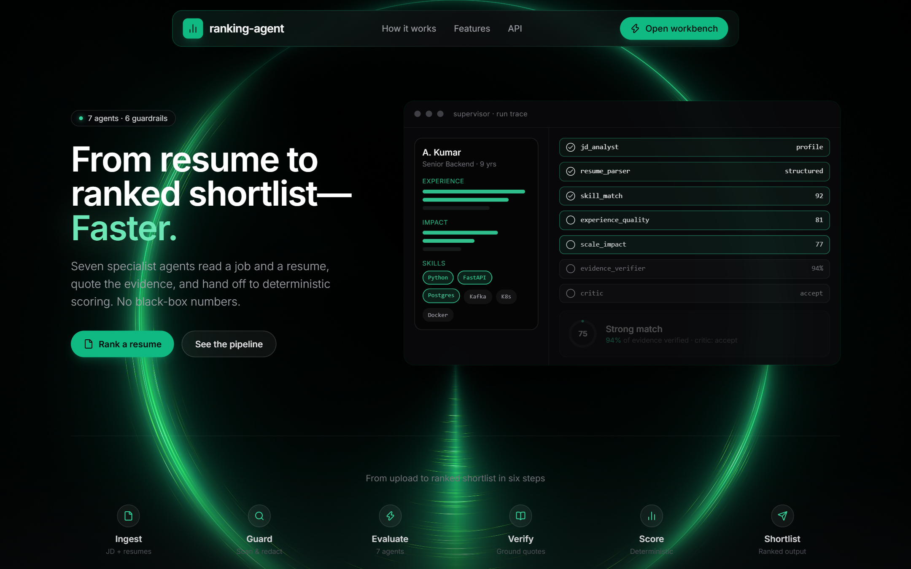
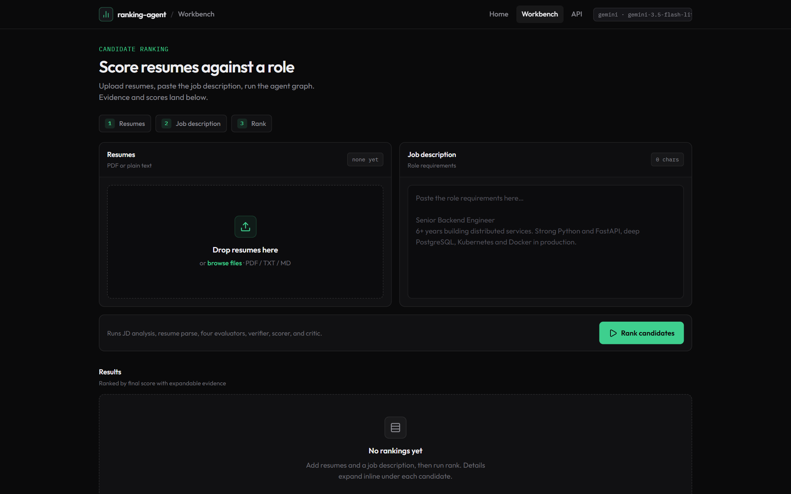
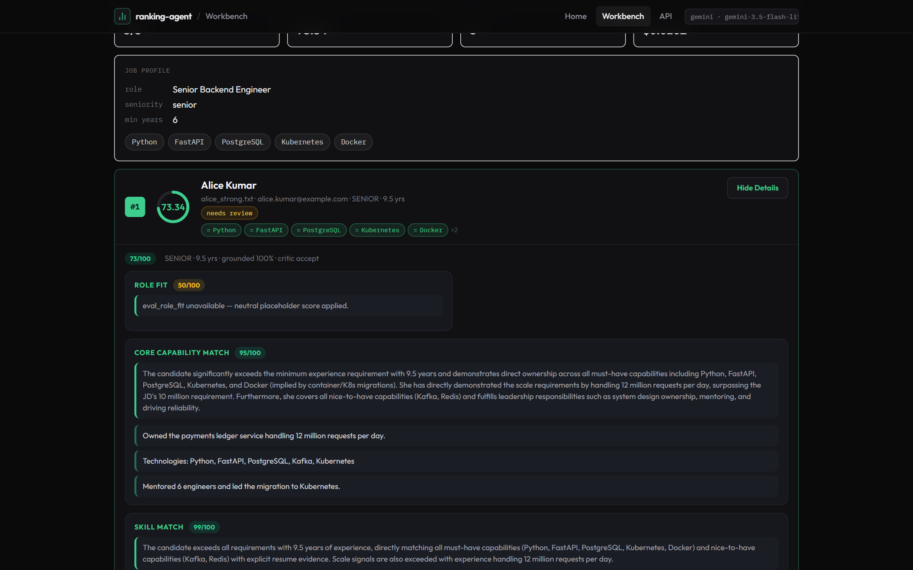

# Multi-Agent Resume Ranking

Seven specialist agents under a supervisor — guardrails, evidence verification, self-critique, and deterministic scoring.







---

## Quick start

```bash
uv sync
cp .env.example .env
# set RANKING_GEMINI_API_KEY=...
uv run fastapi dev
```

| URL | |
|---|---|
| http://127.0.0.1:8000/ | Landing |
| http://127.0.0.1:8000/app | Workbench |
| http://127.0.0.1:8000/docs | OpenAPI |

Defaults (leave model env vars blank): `gemini-3.5-flash-lite` for agents, `gemini-3.5-flash` for the judge. Use `RANKING_PROVIDER=mock` for offline runs.

---

## What it does

```
resume + JD
   │
   ├─ input guardrails      file type, size, JD sanity, prompt-injection scan
   ├─ PII redaction         contact data never reaches the model
   │
   ├─ JD Analyst      ─┐    (parallel)
   ├─ Resume Parser   ─┘
   │
   ├─ 6 evaluator agents    role fit · capability · skills · experience · impact · domain
   │                        (parallel; each returns 0-100 + verbatim quotes)
   │
   ├─ Evidence Verifier     is each quote actually in the resume?
   ├─ Deterministic Scorer  weighted aggregation + explicit penalties
   ├─ Output guardrails     bounds, weight integrity, bias screen
   ├─ Critic                accept / revise / reject → bounded repair loop
   │
   └─ RankResult + full execution trace
```

**LLMs judge, code decides.** Agents emit bounded opinions with evidence; the final score is deterministic arithmetic. No single agent sets the score.

---

## API

| Method | Path | |
|---|---|---|
| `POST` | `/rank` | Rank resume files against one JD (multipart) |
| `POST` | `/rank/text` | Same, resumes as JSON text |
| `POST` | `/analyze-jd` | JD Analyst only |
| `POST` | `/evaluate` | Score one candidate + optional judge |
| `GET` | `/healthz` | Liveness + active config |

```bash
curl -X POST http://127.0.0.1:8000/rank \
  -F "jd_text=Senior Backend Engineer, Python, FastAPI, PostgreSQL..." \
  -F "files=@alice.pdf" \
  -F "files=@bob.pdf"
```

---

## Scoring

| Dimension | Senior | Mid | Fresher |
|---|---|---|---|
| Role Fit | 0.15 | 0.15 | 0.15 |
| Core Capability Match | 0.20 | 0.30 | 0.15 |
| Skill Match | 0.20 | 0.20 | 0.35 |
| Experience Quality | 0.20 | 0.20 | 0.05 |
| Scale & Impact | 0.15 | 0.05 | 0.05 |
| Domain & Context | 0.10 | 0.10 | 0.25 |

`final_score = Σ (raw × weight) − penalties` (groundedness, experience shortfall, missing must-haves at 1.2 each capped at 10).
